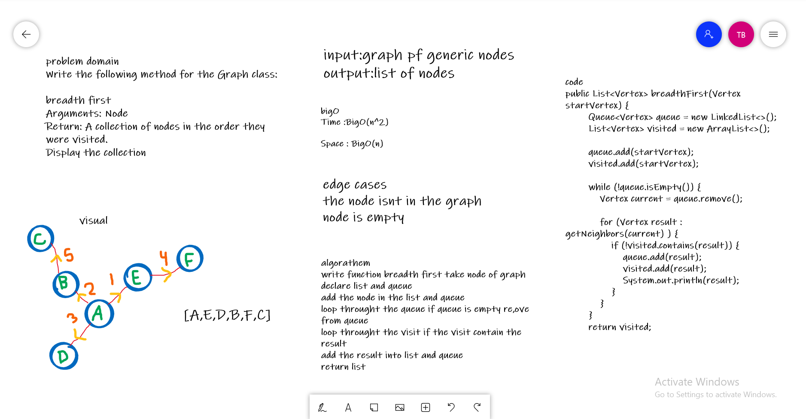

# Graphs
A graph is a non- linear data structure that can be looked at as a collection of vertices (or nodes) potentially connected by line segments named edges.

### code Challenge
Implement your own Graph. The graph should be represented as an adjacency list, and should include the following methods:

* add node

* add edge

* get nodes

* get neighbors

* size

### Approach & Efficiency
add node : time = O(1) 
add edge : time = O(1) 
get nodes : time = O(n)
get neighbors : O(1)
size : O(1) 

API
add node : this method is to add a new node to the graph.

add edge : this method is to add a new edge between two Nodes in the graph.

get nodes : this method returns a HashSet which contains all the Nodes in the graph.

get neighbors : this method return a list of all the Nodes that are connected to the Node we pass.

size : this method returns the size of the graph HashSet.

## cc36

### descriotion

problem domain Write the following method for the Graph class:

breadth first Arguments: Node Return: A collection of nodes in the order they were visited. Display the collection

### white board

### Approach & Efficiency
big O(n)

Time :BigO(n^2) 

Space : BigO(n) 

