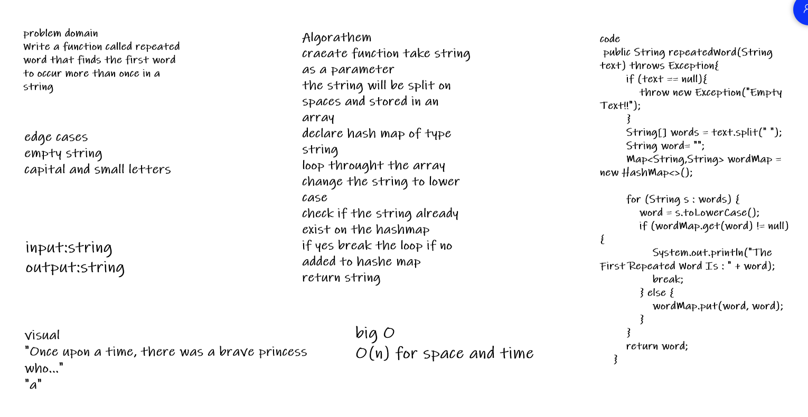
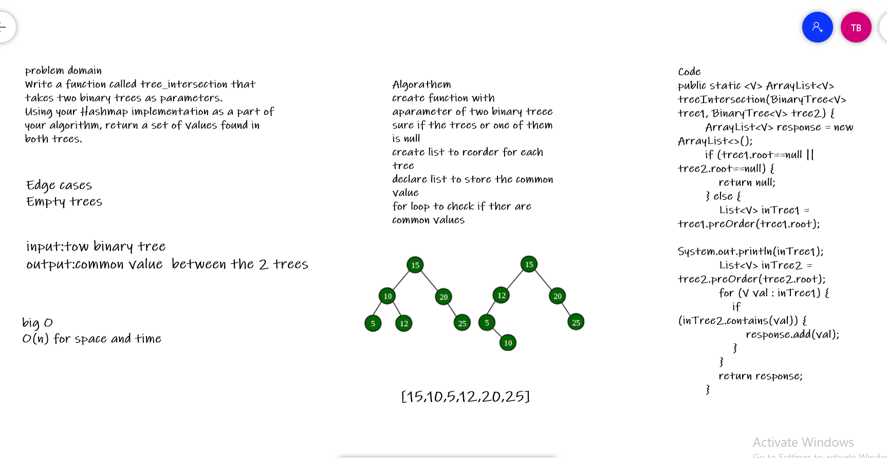
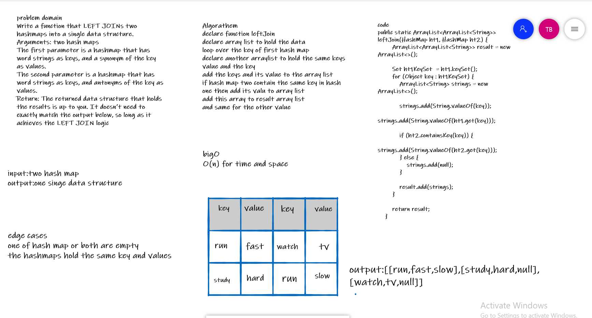

# HashTable

is a data structure that implements an associative array abstract data type, a structure that can map keys to values. A hash table uses a hash function to compute an index, also called a hash code, into an array of buckets or slots, from which the desired value can be found.

### challenge:
Implement a Hashtable Class with the following methods:
add
Arguments: key, value
Returns: nothing
This method should hash the key, and add the key and value pair to the table, handling collisions as needed.
get
Arguments: key
Returns: Value associated with that key in the table
contains
Arguments: key
Returns: Boolean, indicating if the key exists in the table already.
hash
Arguments: key
Returns: Index in the collection for that key

## Approach & Efficiency
Big O for :
add :
Big O space/time O (n)
get
Big O space/time O (n)
contains
Big O space/time O (n)
hash
Big O space/time O (n)
### API
add(T key, T value) :adds the key/value pairs to the table.

get(T key) : return the value from the table based on inserted key.

contains(T key) :takes key as an Arguments and Returns Boolean, indicating if the key exists in the table already.

hash :takes key as an Arguments key and Returns Index in the collection for that key.

## code challenge 31

### description 
Writing a function called repeated word that finds the first word to occur more than once in a string.

### whiteboard

### approch and effeciancy

Time : Big O(n)

Space : Big O(n)

## code challenge 32

### description 
Write a function called tree_intersection that takes two binary trees as parameters.
Using your Hashmap implementation as a part of your algorithm, return a set of values found in both trees.

### whiteboard

### approch and effeciancy

Time : Big O(n)

Space : Big O(n)

## code challenge 32
Write a function that LEFT JOINs two hashmaps into a single data structure.
Write a function called left join
Arguments: two hash maps
The first parameter is a hashmap that has word strings as keys, and a synonym of the key as values.
The second parameter is a hashmap that has word strings as keys, and antonyms of the key as values.
Return: The returned data structure that holds the results is up to you. It doesn’t need to exactly match the output below, so long as it achieves the LEFT JOIN logic

### whiteboard

### approch and effeciancy

Time : Big O(n)

Space : Big O(n)
