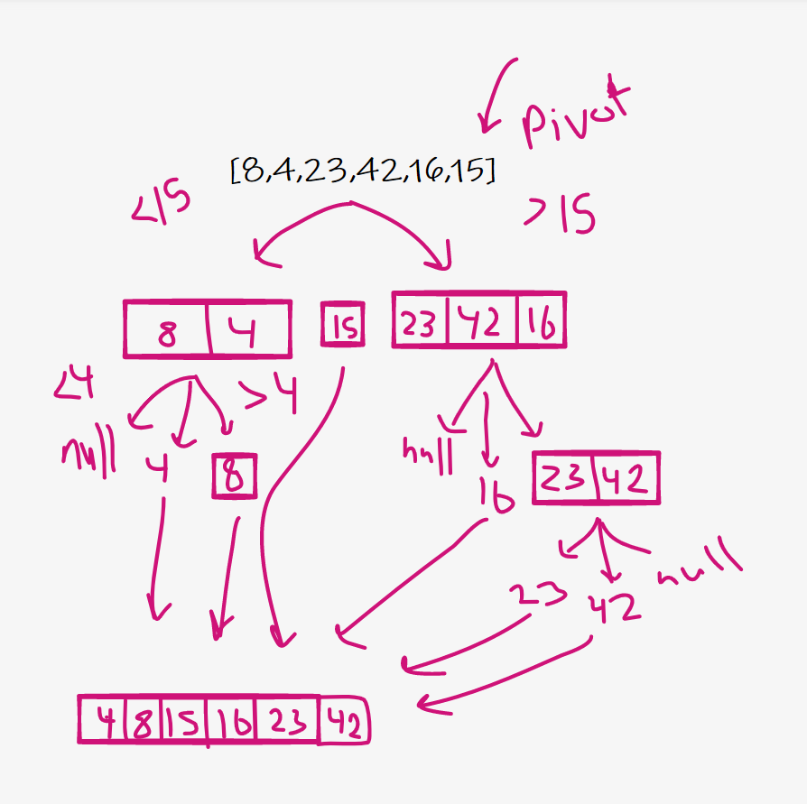

## code challenge 26
### Insertion sort is a simple sorting algorithm that works similar to the way you sort playing cards in your hands. The array is virtually split into a sorted and an unsorted part. Values from the unsorted part are picked and placed at the correct position in the sorted part.

tarting from the second element with the value 4
Compare it to all previous items.
8 > 4  shift the number to the right
There are no more items to compare.

Go to index 2 as value = 23
Compare with all previous items (8, 4)
23 > 8 no need to shift

Go to index 3 as value = 42
Compare with all previous items (23, 8, 4)
42 >23 no need to shift

go the index 4 as value = 16
compare with all previous elements (42, 23, 8, 4)
42 >16 shift 42 to the right.
23 >16 shift 23 to the right.
16 > 8 no need to shift

go the index 5 as value = 15
compare with all previous elements (42, 23, 16, 8, 4)
42 >15 shift 42 to the right.
23 >15 shift 23 to the right.
16 >15 shift 16 to the right.
15 > 8 no need to shift

## code challenge 27
### Merge Sort is a Divide and Conquer algorithm. It divides the input array into two halves, calls itself for the two halves, and then merges the two sorted halves. The merge() function is used for merging two halves. The merge(arr, l, m, r) is a key process that assumes that arr[l..m] and arr[m+1..r] are sorted and merges the two sorted sub-arrays into one. See the following C implementation for details.
### Pseudocode:
ALGORITHM Mergesort(arr)
DECLARE n <-- arr.length

    if n > 1
      DECLARE mid <-- n/2
      DECLARE left <-- arr[0...mid]
      DECLARE right <-- arr[mid...n]
      // sort the left side
      Mergesort(left)
      // sort the right side
      Mergesort(right)
      // merge the sorted left and right sides together
      Merge(left, right, arr)

ALGORITHM Merge(left, right, arr)
DECLARE i <-- 0
DECLARE j <-- 0
DECLARE k <-- 0

    while i < left.length && j < right.length
        if left[i] <= right[j]
            arr[k] <-- left[i]
            i <-- i + 1
        else
            arr[k] <-- right[j]
            j <-- j + 1

        k <-- k + 1

    if i = left.length
       set remaining entries in arr to remaining values in right
    else
       set remaining entries in arr to remaining values in left

In this step, we should calculate the mid-point (array length /2) of the array is divided into two parts, right and left, and separated As a result, we have two arrays

The same step as before, the array is divided after calculating the middle of the array

Here the remaining left part is divided So that we have all the value of the array separate so that we can arrange them

After separating all the values The array is merge from the left side by order from smallest to largest

Like the previous step, the left side is merge to the right side according to the order of the numbers from smallest to largest

And here is the last step, as the left and right sides have been returned, arranged according to numbers In the last step, we will merge left and right sides , resulting in an array arranged according to numbers, from smallest to largest
Efficiency:
Time: O( n Log(n) )
Space: O(1)

## code challenge 28

### Like Merge Sort, QuickSort is a Divide and Conquer algorithm. It picks an element as pivot and partitions the given array around the picked pivot. There are many different versions of quickSort that pick pivot in different ways. 
### psuedocode

ALGORITHM QuickSort(arr, left, right)
if left < right
// Partition the array by setting the position of the pivot value
DEFINE position <-- Partition(arr, left, right)
// Sort the left
QuickSort(arr, left, position - 1)
// Sort the right
QuickSort(arr, position + 1, right)

ALGORITHM Partition(arr, left, right)
// set a pivot value as a point of reference
DEFINE pivot <-- arr[right]
// create a variable to track the largest index of numbers lower than the defined pivot
DEFINE low <-- left - 1
for i <- left to right do
if arr[i] <= pivot
low++
Swap(arr, i, low)

     // place the value of the pivot location in the middle.
     // all numbers smaller than the pivot are on the left, larger on the right.
     Swap(arr, right, low + 1)
    // return the pivot index point
     return low + 1

ALGORITHM Swap(arr, i, low)
DEFINE temp;
temp <-- arr[i]
arr[i] <-- arr[low]
arr[low] <-- temp

step 1 : take on element and make it as a pivot element

step 2 : divid the array into half and sort it for two groups less then pivot and highse then pivot

step 3 : do the same thing for the divided arrays

step 4 :repeat it until i have a sorted array

