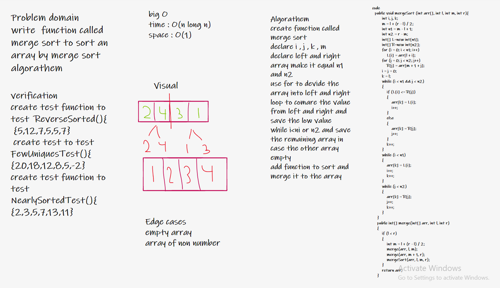

# code challenge 26
# Description

sort an array using insertion method

# whiteboard

# Approach & Efficiency
space :O(1)
time :O(n^2)

# code challenge 27
# Description 
write  function called merge sort to sort an array by merge sort algorathem

# whiteboard

# Approach & Efficiency
time : O(n long n)
space : O(1)